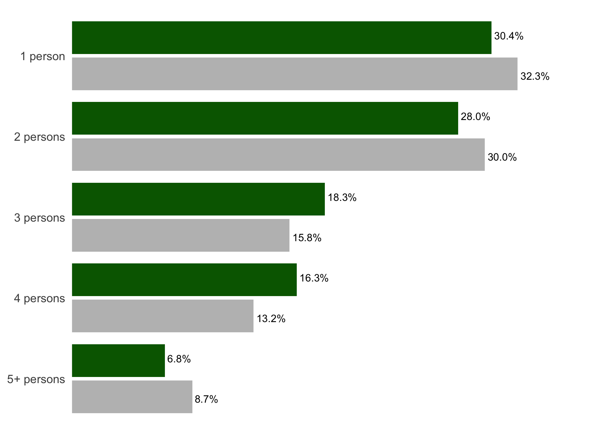
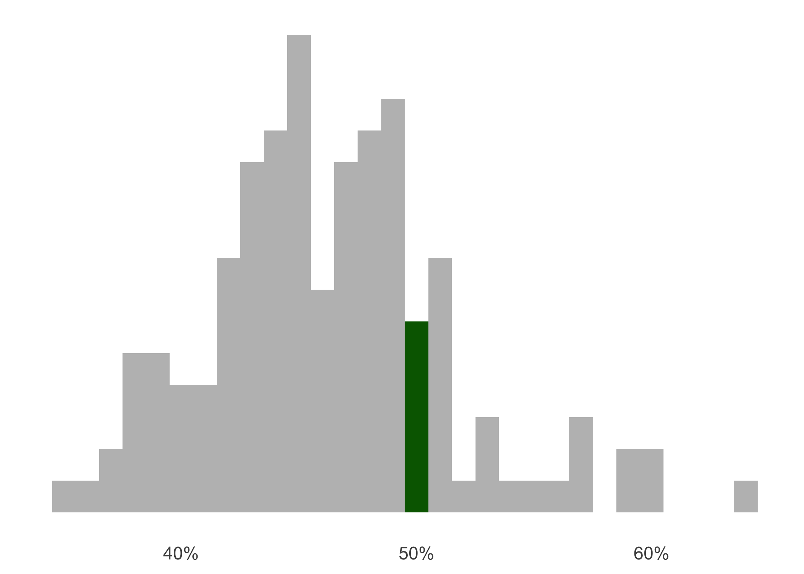

<!-- README.md is generated from README.Rmd. Please edit that file -->

# lemur

CMHC Housing Supply Challenge Proof of Concept

## Installation

You can install lemur from GitHub:

``` r
# install.packages("devtools")
devtools::install_github("purposeanalytics/lemur")
```

The next section discusses usage of the package for *users* of lemur.
For information on the *development*, please skip ahead to the
[“Development” section](#development).

## Usage

### App

The primary product of lemur is a Shiny app which will show low-end of
market rental housing in Toronto, along with other data sets. To load
the app, run:

``` r
library(lemur)
run_app()
```

### Functions

lemur also contains a few utility functions.

#### geocode\_address

For example, you can geocode addresses using the Bing geocoder:

``` r
library(lemur)
geocode_address("220 Yonge St Toronto ON")
#> ℹ Fetching 220 Yonge St Toronto ON - Status: 200
#> # A tibble: 1 x 8
#>   bing_status_code bing_address bing_municipality bing_postal_code bing_method
#>              <int> <chr>        <chr>             <chr>            <chr>      
#> 1              200 220 Yonge St Toronto           M5B 2H1          Rooftop    
#> # … with 3 more variables: bing_confidence <chr>, bing_latitude <dbl>,
#> #   bing_longitude <dbl>
```

This looks up any address in Canada, so it’s helpful to supply the city
or postal code for the most accurate results - for example, 220 Yonge St
without “Toronto ON” gives us somewhere on an island in Lake Huron:

``` r
geocode_address("220 Yonge St")
#> ℹ Fetching 220 Yonge St - Status: 200
#> # A tibble: 1 x 8
#>   bing_status_code bing_address bing_municipality bing_postal_code bing_method  
#>              <int> <chr>        <chr>             <chr>            <chr>        
#> 1              200 220 Yonge St Nipissing         P0H              Interpolatio…
#> # … with 3 more variables: bing_confidence <chr>, bing_latitude <dbl>,
#> #   bing_longitude <dbl>
```

An API token is required, and the function looks for it in the
`BING_TOKEN` environment variable, but this can be changed or supplied
directly via the `token` argument.

#### clean\_neighbourhood\_names

There is also a utility function to clean City of Toronto neighbourhood
names, which often come attached with their neighbourhood numbers
(e.g. “Danforth (66)”) or inconcistent spacing:

``` r
library(opendatatoronto)
library(dplyr)

to_neighbourhoods <- list_package_resources("https://open.toronto.ca/dataset/neighbourhoods/") %>%
  get_resource()

to_neighbourhoods
#> Simple feature collection with 140 features and 17 fields
#> Geometry type: POLYGON
#> Dimension:     XY
#> Bounding box:  xmin: -79.63926 ymin: 43.581 xmax: -79.11527 ymax: 43.85546
#> Geodetic CRS:  WGS 84
#> # A tibble: 140 x 18
#>    `_id` AREA_ID AREA_ATTR_ID PARENT_AREA_ID AREA_SHORT_CODE AREA_LONG_CODE
#>    <int>   <int>        <int> <lgl>          <chr>           <chr>         
#>  1 11481 2480141     26005521 NA             096             096           
#>  2 11482 2480140     26005520 NA             095             095           
#>  3 11483 2480139     26005519 NA             109             109           
#>  4 11484 2480064     26005444 NA             064             064           
#>  5 11485 2480063     26005443 NA             103             103           
#>  6 11486 2480062     26005442 NA             130             130           
#>  7 11487 2480138     26005518 NA             053             053           
#>  8 11488 2480137     26005517 NA             026             026           
#>  9 11489 2480136     26005516 NA             006             006           
#> 10 11490 2480135     26005515 NA             124             124           
#> # … with 130 more rows, and 12 more variables: AREA_NAME <chr>,
#> #   AREA_DESC <chr>, X <lgl>, Y <lgl>, LONGITUDE <lgl>, LATITUDE <lgl>,
#> #   OBJECTID <int>, Shape__Area <dbl>, Shape__Length <dbl>,
#> #   geometry <POLYGON [°]>, CLASSIFICATION <chr>, CLASSIFICATION_CODE <chr>

to_neighbourhoods %>%
  mutate(neighbourhood = clean_neighbourhood_names(AREA_NAME)) %>%
  select(AREA_NAME, neighbourhood)
#> Simple feature collection with 140 features and 2 fields
#> Geometry type: POLYGON
#> Dimension:     XY
#> Bounding box:  xmin: -79.63926 ymin: 43.581 xmax: -79.11527 ymax: 43.85546
#> Geodetic CRS:  WGS 84
#> # A tibble: 140 x 3
#>    AREA_NAME         neighbourhood                                      geometry
#>    <chr>             <chr>                                         <POLYGON [°]>
#>  1 Casa Loma (96)    Casa Loma          ((-79.41469 43.67391, -79.41485 43.6743…
#>  2 Annex (95)        Annex              ((-79.39414 43.66872, -79.39588 43.6683…
#>  3 Caledonia-Fairba… Caledonia-Fairbank ((-79.46021 43.68156, -79.46044 43.6819…
#>  4 Woodbine Corrido… Woodbine Corridor  ((-79.31485 43.66674, -79.3166 43.66636…
#>  5 Lawrence Park So… Lawrence Park Sou… ((-79.41096 43.70408, -79.41165 43.7039…
#>  6 Milliken (130)    Milliken           ((-79.24308 43.81297, -79.24433 43.8127…
#>  7 Henry Farm (53)   Henry Farm         ((-79.35966 43.76649, -79.35966 43.7665…
#>  8 Downsview-Roding… Downsview-Roding-… ((-79.50783 43.71776, -79.50854 43.7176…
#>  9 Kingsview Villag… Kingsview Village… ((-79.55236 43.70947, -79.55229 43.7095…
#> 10 Kennedy Park (12… Kennedy Park       ((-79.24549 43.7306, -79.24555 43.73055…
#> # … with 130 more rows
```

If any of the neighbourhoods can’t be cleaned, the function produces a
warning with the mismatches, and returns all of the neighbourhoods that
*can* be cleaned, cleaned, with the mismatches in their original form:

``` r
tibble(neighbourhood = c(
  "Cabbagetown-South St.James Town (71)",
  "Cabbagetown-South St. James Town (71)"
)) %>%
  mutate(neighbourhood = clean_neighbourhood_names(neighbourhood))
#> Warning: Not all neighbourhoods could be cleaned to match the formats in `neighbourhoods` data.
#> Mismatches: Cabbagetown-South St. James Town (71)
#> # A tibble: 2 x 1
#>   neighbourhood                        
#>   <chr>                                
#> 1 Cabbagetown-South St.James Town      
#> 2 Cabbagetown-South St. James Town (71)
```

If you run into this warning, please give me a shout with the name of
the neighbourhood you’re trying to clean! This function will be reworked
and expanded to handle all the strange spellings we can find :)

### Data sets

lemur contains a number of spatial data sets (used in the app), which
can also be used in other code or packages.

#### toronto

toronto is a data set that includes the boundary of Toronto:

``` r
library(sf)
#> Linking to GEOS 3.8.1, GDAL 3.1.4, PROJ 6.3.1
library(ggplot2)
toronto
#> Simple feature collection with 1 feature and 3 fields
#> Geometry type: POLYGON
#> Dimension:     XY
#> Bounding box:  xmin: -79.63927 ymin: 43.581 xmax: -79.11525 ymax: 43.85547
#> Geodetic CRS:  WGS 84
#> # A tibble: 1 x 4
#>   AREA_ID AREA_NAME OBJECTID                                            geometry
#>     <dbl> <chr>        <dbl>                                       <POLYGON [°]>
#> 1   49886 Toronto   13448849 ((-79.33131 43.6258, -79.33133 43.62571, -79.33153…

p <- ggplot() +
  geom_sf(data = toronto)

p
```


#### neighbourhoods

neighbourhoods contains the 140 social planning neighbourhoods in
Toronto and their boundaries. Once the [new 158
neighbourhoods](https://www.toronto.ca/city-government/data-research-maps/neighbourhoods-communities/neighbourhood-profiles/)
are released by the City of Toronto, this data set will be updated.

``` r
neighbourhoods
#> Simple feature collection with 140 features and 1 field
#> Geometry type: POLYGON
#> Dimension:     XY
#> Bounding box:  xmin: -79.63926 ymin: 43.581 xmax: -79.11527 ymax: 43.85546
#> Geodetic CRS:  WGS 84
#> # A tibble: 140 x 2
#>    neighbourhood                                                        geometry
#>  * <chr>                                                           <POLYGON [°]>
#>  1 Casa Loma              ((-79.41469 43.67391, -79.41485 43.67434, -79.41553 4…
#>  2 Annex                  ((-79.39414 43.66872, -79.39588 43.66833, -79.39738 4…
#>  3 Caledonia-Fairbank     ((-79.46021 43.68156, -79.46044 43.6819, -79.46075 43…
#>  4 Woodbine Corridor      ((-79.31485 43.66674, -79.3166 43.66636, -79.31692 43…
#>  5 Lawrence Park South    ((-79.41096 43.70408, -79.41165 43.70394, -79.41208 4…
#>  6 Milliken               ((-79.24308 43.81297, -79.24433 43.81271, -79.24514 4…
#>  7 Henry Farm             ((-79.35966 43.76649, -79.35966 43.76655, -79.35967 4…
#>  8 Downsview-Roding-CFB   ((-79.50783 43.71776, -79.50854 43.71767, -79.51265 4…
#>  9 Kingsview Village-The… ((-79.55236 43.70947, -79.55229 43.7095, -79.55219 43…
#> 10 Kennedy Park           ((-79.24549 43.7306, -79.24555 43.73055, -79.24563 43…
#> # … with 130 more rows

p <- p +
  geom_sf(data = neighbourhoods)

p
```


#### apartment\_building\_registry

apartment\_building\_registry is a geocoded version of the City of
Toronto’s [Apartment Building Registration
Dataset](https://open.toronto.ca/dataset/apartment-building-registration/),
with cleaned addresses and latitude and longitude:

``` r
apartment_building_registry
#> Simple feature collection with 3479 features and 75 fields
#> Geometry type: POINT
#> Dimension:     XY
#> Bounding box:  xmin: -79.61487 ymin: 43.58818 xmax: -79.14976 ymax: 43.81408
#> Geodetic CRS:  WGS 84
#> # A tibble: 3,479 x 76
#>       id bing_address           bing_municipality bing_postal_code bing_latitude
#>    <dbl> <chr>                  <chr>             <chr>                    <dbl>
#>  1 62272 3725 Dundas St W       Toronto           M6S 2T5                   43.7
#>  2 65726 12 Thorncliffe Park Dr Toronto           M4H 1N8                   43.7
#>  3 62273 2743 Victoria Park Ave <NA>              M1T                       43.8
#>  4 62274 5 Stag Hill Dr         Toronto           M4B 1K7                   43.7
#>  5 62275 1085 Steeles Ave W     <NA>              M2R 2T1                   43.8
#>  6 62276 15 Forty Third St      <NA>              M8W 3P7                   43.6
#>  7 65727 595 Brookdale Ave      Toronto           M5M 1S5                   43.7
#>  8 65728 211 Wilson Ave         Toronto           M5M 3A9                   43.7
#>  9 65729 193 Wilson Ave         Toronto           M5M 4M8                   43.7
#> 10 62277 33 Rosehill Ave        Toronto           M4T 1G4                   43.7
#> # … with 3,469 more rows, and 71 more variables: bing_longitude <dbl>,
#> #   neighbourhood <chr>, air_conditioning_type <chr>,
#> #   amenities_available <chr>, annual_fire_alarm_test_records <chr>,
#> #   annual_fire_pump_flow_test_records <chr>, approved_fire_safety_plan <chr>,
#> #   balconies <chr>, barrier_free_accessibilty_entr <chr>, bike_parking <chr>,
#> #   confirmed_storeys <dbl>, confirmed_units <dbl>,
#> #   date_of_last_inspection_by_tssa <chr>,
#> #   description_of_child_play_area <chr>,
#> #   description_of_indoor_exercise_room <chr>,
#> #   description_of_outdoor_rec_facilities <chr>, elevator_parts_replaced <chr>,
#> #   elevator_status <chr>, emerg_power_supply_test_records <chr>,
#> #   exterior_fire_escape <chr>, …

p +
  geom_point(data = apartment_building_registry, aes(x = bing_longitude, y = bing_latitude))
```


#### neighbourhood\_profiles and city\_profile

neighbourhood\_profiles contains variables describing neighbourhoods in
Toronto from the 2016 census. The data set is a list, with one element
for each neighbourhood. Within each neighbourhood there is one element
for each variable. To see a full description of the variables, see:
`?neighbourhood_profiles`.

``` r
names(neighbourhood_profiles[["Danforth"]])
#>  [1] "population"                  "households"                 
#>  [3] "population_change"           "population_density"         
#>  [5] "household_size"              "average_total_income"       
#>  [7] "unaffordable_housing"        "lim_at"                     
#>  [9] "visible_minority"            "structure_type"             
#> [11] "bedrooms"                    "household_tenure"           
#> [13] "average_renter_shelter_cost"
```

You can compare these to the city values (in `city_profile`)

``` r
names(city_profile)
#>  [1] "population"                              
#>  [2] "households"                              
#>  [3] "population_change"                       
#>  [4] "population_change_distribution"          
#>  [5] "population_density"                      
#>  [6] "population_density_distribution"         
#>  [7] "household_size"                          
#>  [8] "average_total_income"                    
#>  [9] "unaffordable_housing"                    
#> [10] "unaffordable_housing_distribution"       
#> [11] "lim_at"                                  
#> [12] "lim_at_distribution"                     
#> [13] "visible_minority"                        
#> [14] "structure_type"                          
#> [15] "bedrooms"                                
#> [16] "household_tenure"                        
#> [17] "average_renter_shelter_cost"             
#> [18] "average_renter_shelter_cost_distribution"
```

using `plot_neighbourhood_profile()` to compare breakdowns:

``` r
neighbourhood_profiles[["Danforth"]] %>%
  plot_neighbourhood_profile("household_size")
```



or `plot_neighbourhood_profile_distribution()` to compare a value to the
distribution across the city:

``` r
neighbourhood_profiles[["Danforth"]] %>%
  plot_neighbourhood_profile_distribution("unaffordable_housing", binwidth = 0.01) + 
  ggplot2::scale_x_continuous(labels = scales::percent)
```



### address\_points

address\_points() contains the addresses and latitude / longitude for
over 500,000 addresses in the City of Toronto. The data is in a SQLite
database, so just calling `address_points()` returns a preview of the
data:

``` r
address_points()
#> # Source:   table<address_points> [?? x 4]
#> # Database: sqlite 3.35.5 [/Users/sharla/Documents/Consulting/CMHC
#> #   Project/lemur/renv/library/R-4.0/x86_64-apple-darwin17.0/lemur/extdata/lemur.sqlite]
#>     geo_id address            latitude longitude
#>      <dbl> <chr>                 <dbl>     <dbl>
#>  1 5729533 404 Lake Promenade     43.6     -79.5
#>  2 5729531 402 Lake Promenade     43.6     -79.5
#>  3 5729535 407 Lake Promenade     43.6     -79.5
#>  4 5729534 405 Lake Promenade     43.6     -79.5
#>  5 5729532 403 Lake Promenade     43.6     -79.5
#>  6 5729530 401 Lake Promenade     43.6     -79.5
#>  7 7641011 31 Forty First St      43.6     -79.5
#>  8 1002730 23 Garden Pl           43.6     -79.5
#>  9 1002729 21 Garden Pl           43.6     -79.5
#> 10 1002727 19 Garden Pl           43.6     -79.5
#> # … with more rows
```

It can be filtered like a regular data frame, but results must be
“returned” by calling `dplyr::collect()`:

``` r
address_points() %>%
  filter(address == "100 Queen St W") %>%
  collect()
#> # A tibble: 1 x 4
#>   geo_id address        latitude longitude
#>    <dbl> <chr>             <dbl>     <dbl>
#> 1 856375 100 Queen St W     43.7     -79.4
```

The field `geo_id` can be used to connect with some other City of
Toronto data sets, in order to look up the latitude and longitude for an
address.

## Development

To add to lemur code or work within the package repository itself, first
clone the repository and open the project in RStudio.

### renv

This package uses
[`renv`](https://rstudio.github.io/renv/articles/renv.html) for managing
dependencies during the *development* of lemur and to ensure package
versions stay consistent, on your own machine and across other machines.
`renv` isolates dependencies so that e.g. the set of (and versions of)
libraries used in the development of `lemur` can be different than the
libraries used in your other analyses.

This [article about collaborating with
`renv`](https://rstudio.github.io/renv/articles/collaborating.html)
outlines the steps for collaborating with `renv`. The setup has already
been done, so the key is step \#4 under “Collaborating with renv”:

> When a collaborator first launches in this project, renv should
> automatically bootstrap itself, thereby downloading and installing the
> appropriate version of renv into the project library. After this has
> completed, they can then use `renv::restore()` to restore the project
> library locally on their machine.

So, fingers crossed, all you need to do is `renv::restore()` and `renv`
will install all the correct packages and versions for you!

### Loading, developing, and updating code

The [`devtools`](https://devtools.r-lib.org) package is a package
developer’s best friend! It contains all the needed functions to load,
document, test, etc a package.

In particular, `devtools::load_all()` “simulates installing and
reloading your package”, and so it loads all R code in `R/` as well as
any data files in `data/`, allowing you to access all functions and data
without really “installing” the package.

So to load the package and launch the app, you load the package, then
use the `run_app()` function:

``` r
devtools::load_all(".")
# ℹ Loading lemur
run_app()
```

If you make changes to the app, or any other functions / data, just
`devtools::load_all(".")` again and relaunch! Particularly useful is the
*shortcut* for `load_all()`, `control + shift + l` (that’s an L), which
is well-worked into my muscle memory :)
