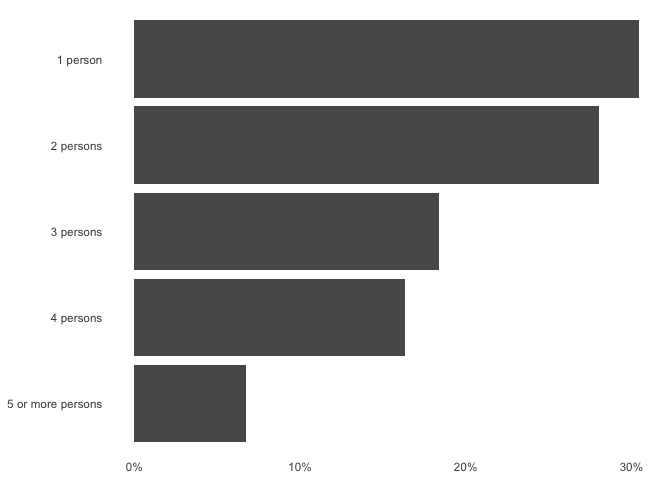
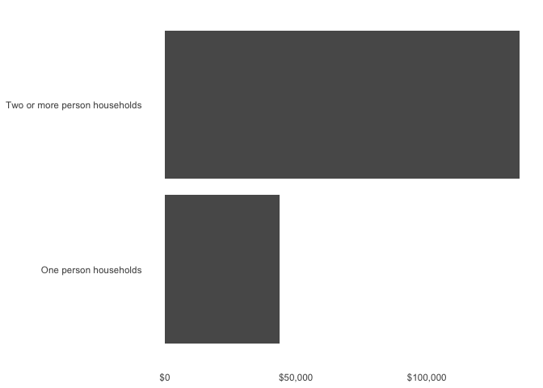
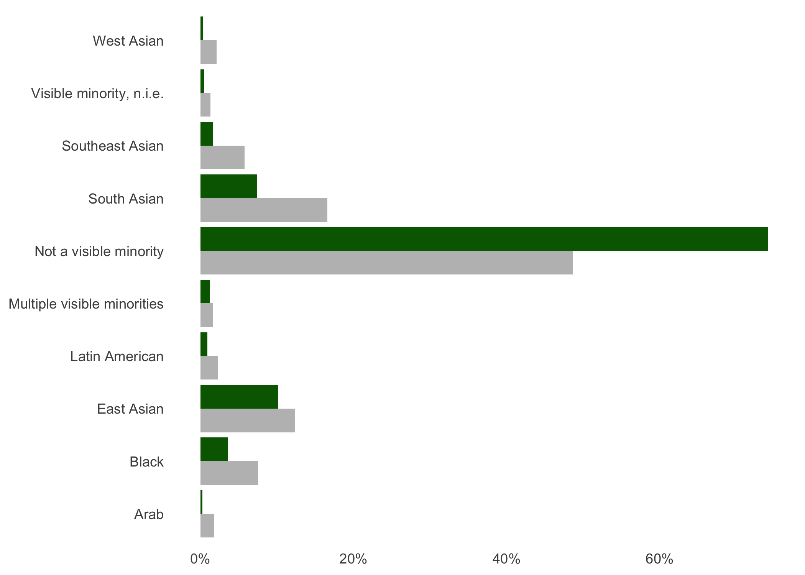
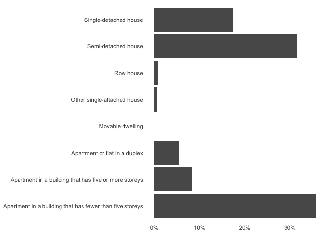
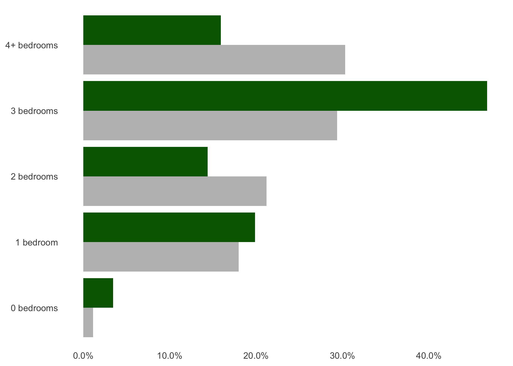
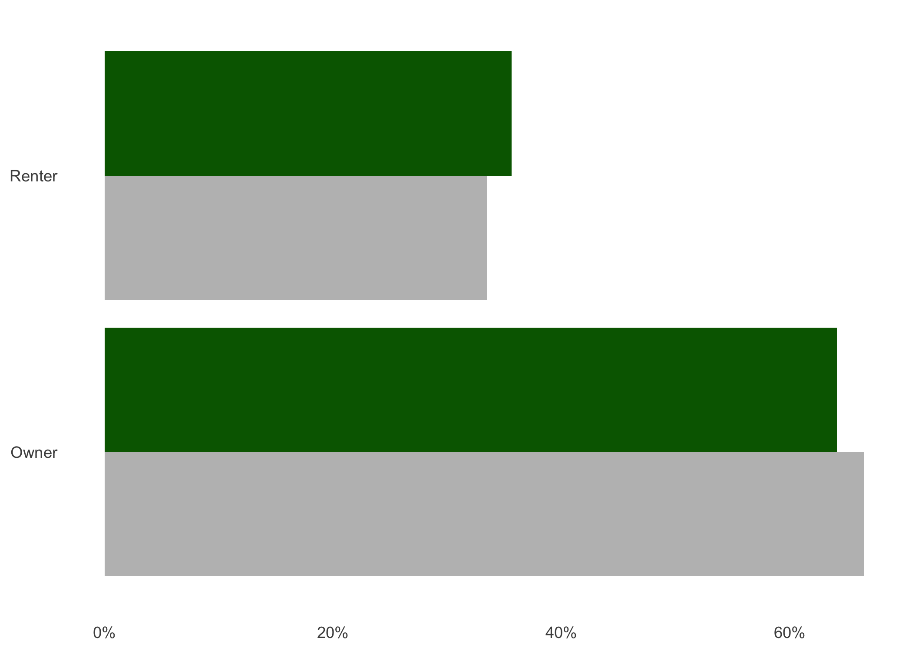

Danforth
================

<!-- # People  -->

# Population: 9,666 (TODO households)

## Population density: 8,554 people per square km

## Household size

<!-- -->

## Mean total income

<!-- -->

# Unaffordable housing: 49.9%

## Total people under poverty measure

## Visible minority population

Total visible minority population: 25.9%

<!-- -->

<!-- # Places -->

## Private dwellings by structure

<!-- -->

## Number of bedrooms

<!-- -->

## Renter versus Owner

<!-- -->

## Shelter Cost
