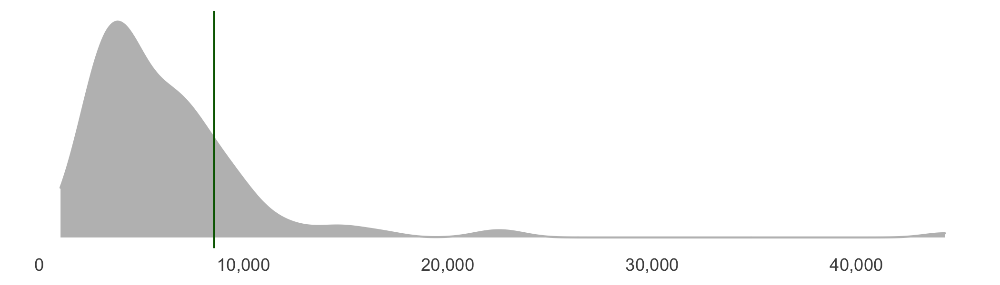
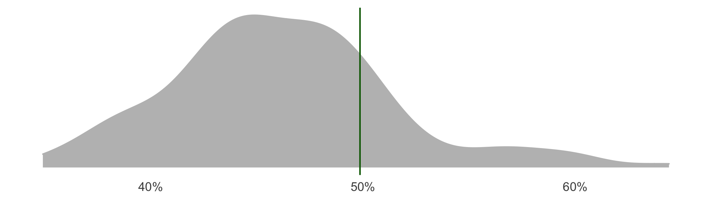
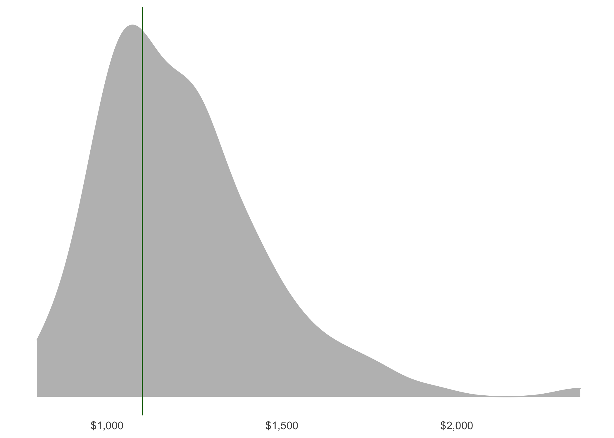

Danforth
================

### Population: 9,666 (3,925 households)

#### Population density

##### 8,554 people per square km

<!-- -->

#### Household size

<!-- -->

##### Mean total income

<!-- -->

##### Unaffordable housing

49.9%

(City: 46.9%)

<!-- -->

#### Total people under poverty measure

#### Visible minority population

Total visible minority population

25.8%

(City: 51.4%)

<!-- -->

# Places

## Private dwellings by structure

<!-- -->

## Number of bedrooms

<!-- -->

## Renter versus Owner

<!-- -->

## Shelter Cost for renters ($1,101 (City: $1,264)

<!-- -->
