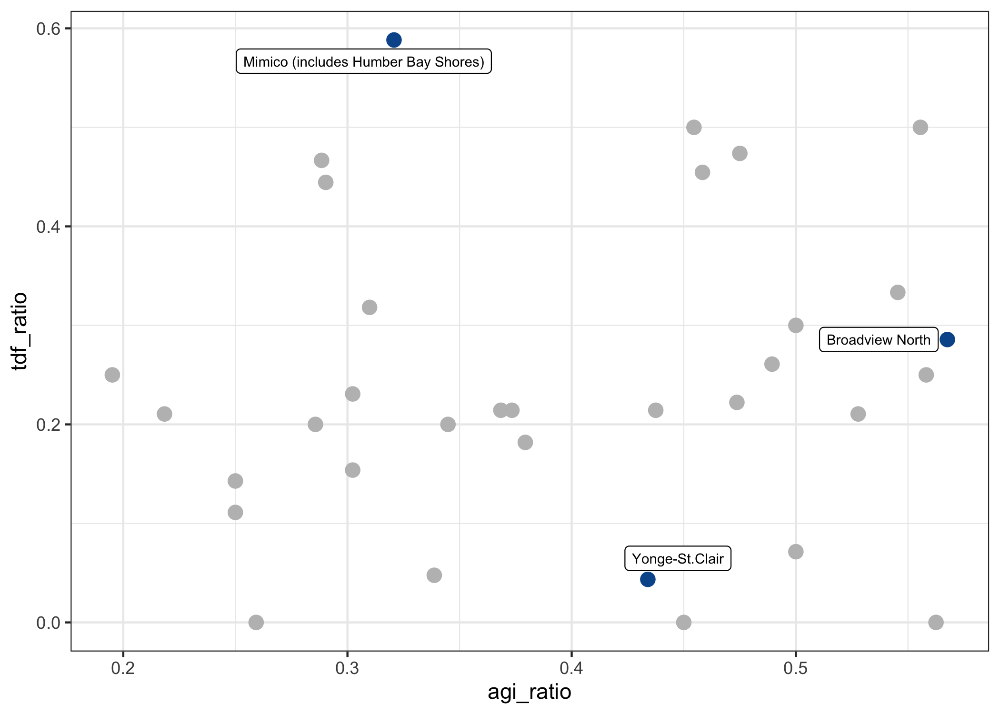

Stories1
================
9/16/2021

    ## # A tibble: 33 × 7
    ##    neighbourhood        Count   AGI   TDF reduced_increase_… agi_ratio tdf_ratio
    ##    <chr>                <int> <int> <int>              <dbl>     <dbl>     <dbl>
    ##  1 Weston                  43    13     2            0.0712      0.302    0.154 
    ##  2 Humewood-Cedarvale      71    22     7            0.0208      0.310    0.318 
    ##  3 Mimico (includes Hu…    53    17    10            0.0206      0.321    0.588 
    ##  4 Annex                   62    21     1            0.0153      0.339    0.0476
    ##  5 Mount Pleasant West     75    28     6            0.0142      0.373    0.214 
    ##  6 Westminster-Branson     33    18     6            0.0127      0.545    0.333 
    ##  7 Willowridge-Marting…    19     9     2            0.012       0.474    0.222 
    ##  8 Islington-City Cent…    22    10     5            0.0116      0.455    0.5   
    ##  9 Bedford Park-Nortown    29    10     2            0.00975     0.345    0.2   
    ## 10 High Park North         24    11     5            0.00876     0.458    0.455 
    ## # … with 23 more rows

<!-- -->

<table class="table" style="margin-left: auto; margin-right: auto;">
<caption>
Highlighted Neighbourhoods
</caption>
<thead>
<tr>
<th style="text-align:left;">
neighbourhood
</th>
<th style="text-align:right;">
Count
</th>
<th style="text-align:right;">
AGI
</th>
<th style="text-align:right;">
TDF
</th>
<th style="text-align:left;">
agi\_ratio
</th>
<th style="text-align:left;">
tdf\_ratio
</th>
</tr>
</thead>
<tbody>
<tr>
<td style="text-align:left;">
Mimico (includes Humber Bay Shores)
</td>
<td style="text-align:right;">
53
</td>
<td style="text-align:right;">
17
</td>
<td style="text-align:right;">
10
</td>
<td style="text-align:left;">
32.1%
</td>
<td style="text-align:left;">
58.8%
</td>
</tr>
<tr>
<td style="text-align:left;">
Broadview North
</td>
<td style="text-align:right;">
37
</td>
<td style="text-align:right;">
21
</td>
<td style="text-align:right;">
6
</td>
<td style="text-align:left;">
56.8%
</td>
<td style="text-align:left;">
28.6%
</td>
</tr>
<tr>
<td style="text-align:left;">
Yonge-St.Clair
</td>
<td style="text-align:right;">
53
</td>
<td style="text-align:right;">
23
</td>
<td style="text-align:right;">
1
</td>
<td style="text-align:left;">
43.4%
</td>
<td style="text-align:left;">
4.3%
</td>
</tr>
</tbody>
</table>
