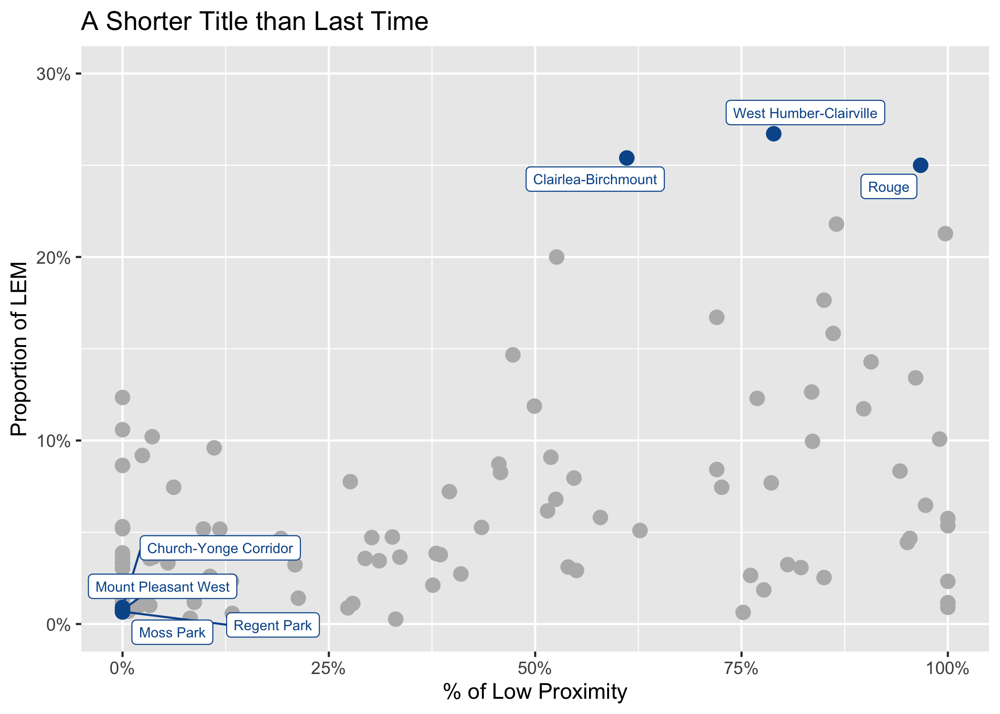
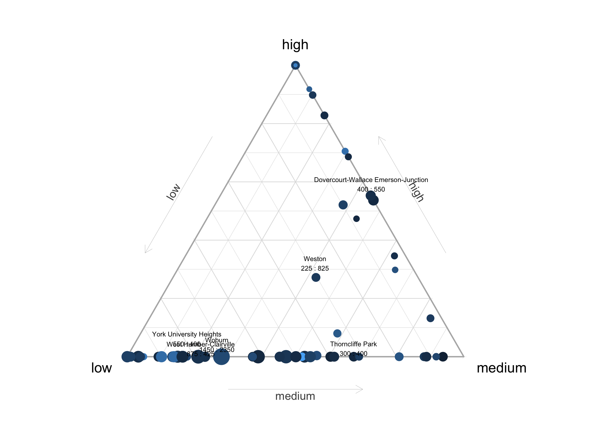

Story 2
================
9/21/2021

# Story 2 Concept

1.  omg look at this app, you can click these layers!

    -   **Concept: the horseshoe is where we start to see the line
        between rich and poor**

        -   proximity?!? everything is downtown, where its expensive

        -   evictions?!? oh no poor neighbourhoods seem more

2.  toronto is sort of “three cities” where the rich live with the rich,
    poor with the poor, and the middle with the middle \[if such a thing
    exists\], but historically, it used to be these mixed income
    neighbourhoods with maybe some exceptions like rosedale or whatever

    -   **Concept: we’re trying to show this with evictions & housing
        needs + LEMR availability**

3.  so then proximity can sort of show the current story of the poor

    -   **Concept: we’re trying to show these two distinct clusters of
        neighbourhoods**

        -   poor means you can either live with low access to service
            *OR* in toronto community housing

## lowend similarities

<!-- -->

<table class="table" style="margin-left: auto; margin-right: auto;">
<caption>
Highlighted Neighbourhoods
</caption>
<thead>
<tr>
<th style="text-align:left;">
Neighbourhood
</th>
<th style="text-align:right;">
Total Total
</th>
<th style="text-align:left;">
Eviction Rate
</th>
<th style="text-align:left;">
Unaffordable Housing
</th>
<th style="text-align:left;">
Market Prop Other Non Market
</th>
<th style="text-align:left;">
Core Housing Need
</th>
</tr>
</thead>
<tbody>
<tr>
<td style="text-align:left;">
Woburn
</td>
<td style="text-align:right;">
1450
</td>
<td style="text-align:left;">
5.3%
</td>
<td style="text-align:left;">
43.6%
</td>
<td style="text-align:left;">
27.1%
</td>
<td style="text-align:left;">
49.0%
</td>
</tr>
<tr>
<td style="text-align:left;">
West Humber-Clairville
</td>
<td style="text-align:right;">
875
</td>
<td style="text-align:left;">
5.6%
</td>
<td style="text-align:left;">
42.1%
</td>
<td style="text-align:left;">
13.0%
</td>
<td style="text-align:left;">
36.7%
</td>
</tr>
<tr>
<td style="text-align:left;">
York University Heights
</td>
<td style="text-align:right;">
550
</td>
<td style="text-align:left;">
11.9%
</td>
<td style="text-align:left;">
48.7%
</td>
<td style="text-align:left;">
7.2%
</td>
<td style="text-align:left;">
43.5%
</td>
</tr>
<tr>
<td style="text-align:left;">
Dovercourt-Wallace Emerson-Junction
</td>
<td style="text-align:right;">
400
</td>
<td style="text-align:left;">
3.4%
</td>
<td style="text-align:left;">
49.2%
</td>
<td style="text-align:left;">
7.1%
</td>
<td style="text-align:left;">
34.7%
</td>
</tr>
<tr>
<td style="text-align:left;">
Thorncliffe Park
</td>
<td style="text-align:right;">
300
</td>
<td style="text-align:left;">
2.4%
</td>
<td style="text-align:left;">
51.9%
</td>
<td style="text-align:left;">
6.3%
</td>
<td style="text-align:left;">
51.0%
</td>
</tr>
</tbody>
</table>

## proximity

### total

<table class="table" style="margin-left: auto; margin-right: auto;">
<caption>
Top 5 neighbourhoods by High Medium with at least 250 Total LEM
</caption>
<thead>
<tr>
<th style="text-align:left;">
Neighbourhood
</th>
<th style="text-align:left;">
High Medium
</th>
<th style="text-align:left;">
High
</th>
<th style="text-align:left;">
Medium
</th>
<th style="text-align:left;">
Low
</th>
<th style="text-align:right;">
Total Lem
</th>
<th style="text-align:right;">
Tchc
</th>
</tr>
</thead>
<tbody>
<tr>
<td style="text-align:left;">
Dovercourt-Wallace Emerson-Junction
</td>
<td style="text-align:left;">
100.0%
</td>
<td style="text-align:left;">
53.7%
</td>
<td style="text-align:left;">
46.3%
</td>
<td style="text-align:left;">
0.0%
</td>
<td style="text-align:right;">
400
</td>
<td style="text-align:right;">
450
</td>
</tr>
<tr>
<td style="text-align:left;">
Oakwood Village
</td>
<td style="text-align:left;">
100.0%
</td>
<td style="text-align:left;">
55.3%
</td>
<td style="text-align:left;">
44.7%
</td>
<td style="text-align:left;">
0.0%
</td>
<td style="text-align:right;">
350
</td>
<td style="text-align:right;">
325
</td>
</tr>
<tr>
<td style="text-align:left;">
Henry Farm
</td>
<td style="text-align:left;">
93.8%
</td>
<td style="text-align:left;">
0.0%
</td>
<td style="text-align:left;">
93.8%
</td>
<td style="text-align:left;">
6.2%
</td>
<td style="text-align:right;">
300
</td>
<td style="text-align:right;">
0
</td>
</tr>
<tr>
<td style="text-align:left;">
Ionview
</td>
<td style="text-align:left;">
88.9%
</td>
<td style="text-align:left;">
0.0%
</td>
<td style="text-align:left;">
88.9%
</td>
<td style="text-align:left;">
11.1%
</td>
<td style="text-align:right;">
300
</td>
<td style="text-align:right;">
250
</td>
</tr>
<tr>
<td style="text-align:left;">
Thorncliffe Park
</td>
<td style="text-align:left;">
67.3%
</td>
<td style="text-align:left;">
0.0%
</td>
<td style="text-align:left;">
67.3%
</td>
<td style="text-align:left;">
32.7%
</td>
<td style="text-align:right;">
300
</td>
<td style="text-align:right;">
200
</td>
</tr>
</tbody>
</table>

    ## # A tibble: 5 × 7
    ##   neighbourhood       HighMedium  High Medium   Low TotalLEM  TCHC
    ##   <chr>                    <dbl> <dbl>  <dbl> <dbl>    <dbl> <dbl>
    ## 1 Morningside              0         0  0     0.997      500   375
    ## 2 Scarborough Village      0.01      0  0.01  0.99       325   575
    ## 3 Newtonbrook West         0.027     0  0.027 0.973      275     0
    ## 4 Rouge                    0.033     0  0.033 0.967      550     0
    ## 5 Yorkdale-Glen Park       0.039     0  0.039 0.961      275   375

    ## # A tibble: 5 × 7
    ##   neighbourhood   HighMedium  High Medium   Low TotalLEM  TCHC
    ##   <chr>                <dbl> <dbl>  <dbl> <dbl>    <dbl> <dbl>
    ## 1 Regent Park              1 1      0         0       25  2025
    ## 2 North Riverdale          1 0.384  0.616     0       25    25
    ## 3 Moss Park                1 0.918  0.082     0       50  2350
    ## 4 Danforth                 1 0.866  0.134     0       50   350
    ## 5 Roncesvalles             1 0.738  0.262     0       75   400

    ## # A tibble: 5 × 7
    ##   neighbourhood           HighMedium  High Medium   Low TotalLEM  TCHC
    ##   <chr>                        <dbl> <dbl>  <dbl> <dbl>    <dbl> <dbl>
    ## 1 North Riverdale                  1 0.384  0.616     0       25    25
    ## 2 Danforth                         1 0.866  0.134     0       50   350
    ## 3 Roncesvalles                     1 0.738  0.262     0       75   400
    ## 4 Wychwood                         1 0.523  0.477     0      100   150
    ## 5 Palmerston-Little Italy          1 0.973  0.027     0      125   150

    ## # A tibble: 5 × 7
    ##   neighbourhood          HighMedium  High Medium   Low TotalLEM  TCHC
    ##   <chr>                       <dbl> <dbl>  <dbl> <dbl>    <dbl> <dbl>
    ## 1 Woburn                      0.28      0  0.28  0.72      1450  1975
    ## 2 West Humber-Clairville      0.211     0  0.211 0.789      875   225
    ## 3 Clairlea-Birchmount         0.389     0  0.389 0.611      800   200
    ## 4 Malvern                     0.47      0  0.47  0.526      800   475
    ## 5 Dorset Park                 0.15      0  0.15  0.85       600   475

<!-- --> \#\#\# prop

    ## # A tibble: 140 × 10
    ##    neighbourhood      HighMedium  High Medium   Low LEMProp Stock TotalLEM  TCHC
    ##    <chr>                   <dbl> <dbl>  <dbl> <dbl>   <dbl> <dbl>    <dbl> <dbl>
    ##  1 Corso Italia-Dave…          1 0.687  0.313     0  0.123   2025      250     0
    ##  2 Weston-Pellam Park          1 0.68   0.32      0  0.114   1750      200   600
    ##  3 University                  1 0.962  0.038     0  0.106   2125      225   150
    ##  4 Oakwood Village             1 0.553  0.447     0  0.0864  4050      350   325
    ##  5 Keelesdale-Eglint…          1 0.169  0.831     0  0.0781  1600      125   200
    ##  6 Blake-Jones                 1 0.705  0.295     0  0.0690  1450      100   675
    ##  7 Trinity-Bellwoods           1 0.671  0.329     0  0.0530  3300      175     0
    ##  8 Dovercourt-Wallac…          1 0.537  0.463     0  0.0519  7700      400   450
    ##  9 Dufferin Grove              1 0.54   0.46      0  0.0388  3225      125    25
    ## 10 Kensington-Chinat…          1 1      0         0  0.0361  6225      225  1475
    ## # … with 130 more rows, and 1 more variable: NonMarket <dbl>

    ## # A tibble: 140 × 10
    ##    neighbourhood      HighMedium  High Medium   Low LEMProp Stock TotalLEM  TCHC
    ##    <chr>                   <dbl> <dbl>  <dbl> <dbl>   <dbl> <dbl>    <dbl> <dbl>
    ##  1 Elms-Old Rexdale        0         0  0     1     0.0678   1475      100   350
    ##  2 Newtonbrook East        0         0  0     1     0.0575   2175      125     0
    ##  3 Bathurst Manor          0         0  0     1     0.0536   2800      150   375
    ##  4 Etobicoke West Ma…      0         0  0     1     0.0233   2150       50    25
    ##  5 Markland Wood           0         0  0     1     0.0227   1100       25     0
    ##  6 St.Andrew-Windfie…      0         0  0     1     0.0116   2150       25    50
    ##  7 Edenbridge-Humber…      0         0  0     1     0.00909  2750       25     0
    ##  8 Morningside             0         0  0     0.997 0.213    2350      500   375
    ##  9 Scarborough Villa…      0.01      0  0.01  0.99  0.101    3225      325   575
    ## 10 Kingsway South          0.022     0  0.022 0.978 0.0769    650       50     0
    ## # … with 130 more rows, and 1 more variable: NonMarket <dbl>

    ## # A tibble: 102 × 10
    ##    neighbourhood      HighMedium  High Medium   Low LEMProp Stock TotalLEM  TCHC
    ##    <chr>                   <dbl> <dbl>  <dbl> <dbl>   <dbl> <dbl>    <dbl> <dbl>
    ##  1 North Riverdale             1 0.384  0.616     0  0.0114  2200       25    25
    ##  2 Bay Street Corrid…          1 0.759  0.241     0  0.0122 10250      125   175
    ##  3 Roncesvalles                1 0.738  0.262     0  0.0194  3875       75   400
    ##  4 Little Portugal             1 0.425  0.575     0  0.0303  4125      125   125
    ##  5 Wychwood                    1 0.523  0.477     0  0.0331  3025      100   150
    ##  6 Palmerston-Little…          1 0.973  0.027     0  0.0336  3725      125   150
    ##  7 Danforth                    1 0.866  0.134     0  0.0357  1400       50   350
    ##  8 Dufferin Grove              1 0.54   0.46      0  0.0388  3225      125    25
    ##  9 Dovercourt-Wallac…          1 0.537  0.463     0  0.0519  7700      400   450
    ## 10 Trinity-Bellwoods           1 0.671  0.329     0  0.0530  3300      175     0
    ## # … with 92 more rows, and 1 more variable: NonMarket <dbl>

    ## # A tibble: 140 × 10
    ##    neighbourhood      HighMedium  High Medium   Low LEMProp Stock TotalLEM  TCHC
    ##    <chr>                   <dbl> <dbl>  <dbl> <dbl>   <dbl> <dbl>    <dbl> <dbl>
    ##  1 Moss Park                   1 0.918  0.082     0 0.00656  7625       50  2350
    ##  2 Regent Park                 1 1      0         0 0.00676  3700       25  2025
    ##  3 Mount Pleasant We…          1 0.686  0.314     0 0.00765 13075      100   950
    ##  4 Church-Yonge Corr…          1 0.898  0.102     0 0.00903 13850      125  1150
    ##  5 North Riverdale             1 0.384  0.616     0 0.0114   2200       25    25
    ##  6 Bay Street Corrid…          1 0.759  0.241     0 0.0122  10250      125   175
    ##  7 Annex                       1 0.828  0.172     0 0.0152   9850      150   600
    ##  8 North St.James To…          1 1      0         0 0.0174   8625      150  1675
    ##  9 Roncesvalles                1 0.738  0.262     0 0.0194   3875       75   400
    ## 10 Little Portugal             1 0.425  0.575     0 0.0303   4125      125   125
    ## # … with 130 more rows, and 1 more variable: NonMarket <dbl>

    ## # A tibble: 105 × 10
    ##    neighbourhood      HighMedium  High Medium   Low LEMProp Stock TotalLEM  TCHC
    ##    <chr>                   <dbl> <dbl>  <dbl> <dbl>   <dbl> <dbl>    <dbl> <dbl>
    ##  1 West Humber-Clair…      0.211     0  0.211 0.789   0.267  3275      875   225
    ##  2 Clairlea-Birchmou…      0.389     0  0.389 0.611   0.254  3150      800   200
    ##  3 Rouge                   0.033     0  0.033 0.967   0.25   2200      550     0
    ##  4 Cliffcrest              0.135     0  0.135 0.865   0.218  1950      425   425
    ##  5 Morningside             0         0  0     0.997   0.213  2350      500   375
    ##  6 Malvern                 0.47      0  0.47  0.526   0.2    4000      800   475
    ##  7 Dorset Park             0.15      0  0.15  0.85    0.176  3400      600   475
    ##  8 Woburn                  0.28      0  0.28  0.72    0.167  8675     1450  1975
    ##  9 Kennedy Park            0.139     0  0.139 0.861   0.158  3000      475  1300
    ## 10 Bendale                 0.527     0  0.527 0.473   0.147  3750      550   225
    ## # … with 95 more rows, and 1 more variable: NonMarket <dbl>

<!-- -->

### ternary

<!-- -->

<table class="table" style="margin-left: auto; margin-right: auto;">
<caption>
Filtered @225 total\_total neighbourhoods
</caption>
<thead>
<tr>
<th style="text-align:left;">
Neighbourhood
</th>
<th style="text-align:left;">
High
</th>
<th style="text-align:left;">
Medium
</th>
<th style="text-align:left;">
Low
</th>
<th style="text-align:right;">
Total Total
</th>
<th style="text-align:right;">
Number of Buildings
</th>
</tr>
</thead>
<tbody>
<tr>
<td style="text-align:left;">
Agincourt North
</td>
<td style="text-align:left;">
0.0%
</td>
<td style="text-align:left;">
30.4%
</td>
<td style="text-align:left;">
69.6%
</td>
<td style="text-align:right;">
225
</td>
<td style="text-align:right;">
3
</td>
</tr>
<tr>
<td style="text-align:left;">
Agincourt South-Malvern West
</td>
<td style="text-align:left;">
0.0%
</td>
<td style="text-align:left;">
9.3%
</td>
<td style="text-align:left;">
90.7%
</td>
<td style="text-align:right;">
325
</td>
<td style="text-align:right;">
3
</td>
</tr>
<tr>
<td style="text-align:left;">
Bendale
</td>
<td style="text-align:left;">
0.0%
</td>
<td style="text-align:left;">
52.7%
</td>
<td style="text-align:left;">
47.3%
</td>
<td style="text-align:right;">
550
</td>
<td style="text-align:right;">
14
</td>
</tr>
<tr>
<td style="text-align:left;">
Birchcliffe-Cliffside
</td>
<td style="text-align:left;">
0.0%
</td>
<td style="text-align:left;">
23.1%
</td>
<td style="text-align:left;">
76.9%
</td>
<td style="text-align:right;">
375
</td>
<td style="text-align:right;">
53
</td>
</tr>
<tr>
<td style="text-align:left;">
Briar Hill-Belgravia
</td>
<td style="text-align:left;">
8.6%
</td>
<td style="text-align:left;">
63.7%
</td>
<td style="text-align:left;">
27.6%
</td>
<td style="text-align:right;">
225
</td>
<td style="text-align:right;">
25
</td>
</tr>
<tr>
<td style="text-align:left;">
Brookhaven-Amesbury
</td>
<td style="text-align:left;">
8.5%
</td>
<td style="text-align:left;">
33.5%
</td>
<td style="text-align:left;">
57.9%
</td>
<td style="text-align:right;">
225
</td>
<td style="text-align:right;">
39
</td>
</tr>
<tr>
<td style="text-align:left;">
Clairlea-Birchmount
</td>
<td style="text-align:left;">
0.0%
</td>
<td style="text-align:left;">
38.9%
</td>
<td style="text-align:left;">
61.1%
</td>
<td style="text-align:right;">
800
</td>
<td style="text-align:right;">
31
</td>
</tr>
<tr>
<td style="text-align:left;">
Clanton Park
</td>
<td style="text-align:left;">
0.0%
</td>
<td style="text-align:left;">
5.8%
</td>
<td style="text-align:left;">
94.2%
</td>
<td style="text-align:right;">
250
</td>
<td style="text-align:right;">
59
</td>
</tr>
<tr>
<td style="text-align:left;">
Cliffcrest
</td>
<td style="text-align:left;">
0.0%
</td>
<td style="text-align:left;">
13.5%
</td>
<td style="text-align:left;">
86.5%
</td>
<td style="text-align:right;">
425
</td>
<td style="text-align:right;">
12
</td>
</tr>
<tr>
<td style="text-align:left;">
Corso Italia-Davenport
</td>
<td style="text-align:left;">
68.7%
</td>
<td style="text-align:left;">
31.3%
</td>
<td style="text-align:left;">
0.0%
</td>
<td style="text-align:right;">
250
</td>
<td style="text-align:right;">
5
</td>
</tr>
<tr>
<td style="text-align:left;">
Don Valley Village
</td>
<td style="text-align:left;">
0.0%
</td>
<td style="text-align:left;">
60.4%
</td>
<td style="text-align:left;">
39.6%
</td>
<td style="text-align:right;">
350
</td>
<td style="text-align:right;">
21
</td>
</tr>
<tr>
<td style="text-align:left;">
Dorset Park
</td>
<td style="text-align:left;">
0.0%
</td>
<td style="text-align:left;">
15.0%
</td>
<td style="text-align:left;">
85.0%
</td>
<td style="text-align:right;">
600
</td>
<td style="text-align:right;">
24
</td>
</tr>
<tr>
<td style="text-align:left;">
Dovercourt-Wallace Emerson-Junction
</td>
<td style="text-align:left;">
53.7%
</td>
<td style="text-align:left;">
46.3%
</td>
<td style="text-align:left;">
0.0%
</td>
<td style="text-align:right;">
400
</td>
<td style="text-align:right;">
19
</td>
</tr>
<tr>
<td style="text-align:left;">
Eglinton East
</td>
<td style="text-align:left;">
0.0%
</td>
<td style="text-align:left;">
16.5%
</td>
<td style="text-align:left;">
83.5%
</td>
<td style="text-align:right;">
550
</td>
<td style="text-align:right;">
29
</td>
</tr>
<tr>
<td style="text-align:left;">
Flemingdon Park
</td>
<td style="text-align:left;">
0.0%
</td>
<td style="text-align:left;">
88.2%
</td>
<td style="text-align:left;">
11.8%
</td>
<td style="text-align:right;">
225
</td>
<td style="text-align:right;">
17
</td>
</tr>
<tr>
<td style="text-align:left;">
Glenfield-Jane Heights
</td>
<td style="text-align:left;">
0.0%
</td>
<td style="text-align:left;">
80.8%
</td>
<td style="text-align:left;">
19.2%
</td>
<td style="text-align:right;">
225
</td>
<td style="text-align:right;">
24
</td>
</tr>
<tr>
<td style="text-align:left;">
Greenwood-Coxwell
</td>
<td style="text-align:left;">
55.2%
</td>
<td style="text-align:left;">
42.4%
</td>
<td style="text-align:left;">
2.4%
</td>
<td style="text-align:right;">
225
</td>
<td style="text-align:right;">
15
</td>
</tr>
<tr>
<td style="text-align:left;">
Henry Farm
</td>
<td style="text-align:left;">
0.0%
</td>
<td style="text-align:left;">
93.8%
</td>
<td style="text-align:left;">
6.2%
</td>
<td style="text-align:right;">
300
</td>
<td style="text-align:right;">
16
</td>
</tr>
<tr>
<td style="text-align:left;">
Highland Creek
</td>
<td style="text-align:left;">
0.0%
</td>
<td style="text-align:left;">
37.3%
</td>
<td style="text-align:left;">
62.7%
</td>
<td style="text-align:right;">
300
</td>
<td style="text-align:right;">
0
</td>
</tr>
<tr>
<td style="text-align:left;">
Ionview
</td>
<td style="text-align:left;">
0.0%
</td>
<td style="text-align:left;">
88.9%
</td>
<td style="text-align:left;">
11.1%
</td>
<td style="text-align:right;">
300
</td>
<td style="text-align:right;">
34
</td>
</tr>
<tr>
<td style="text-align:left;">
Junction Area
</td>
<td style="text-align:left;">
38.7%
</td>
<td style="text-align:left;">
57.7%
</td>
<td style="text-align:left;">
3.6%
</td>
<td style="text-align:right;">
250
</td>
<td style="text-align:right;">
6
</td>
</tr>
<tr>
<td style="text-align:left;">
Kennedy Park
</td>
<td style="text-align:left;">
0.0%
</td>
<td style="text-align:left;">
13.9%
</td>
<td style="text-align:left;">
86.1%
</td>
<td style="text-align:right;">
475
</td>
<td style="text-align:right;">
22
</td>
</tr>
<tr>
<td style="text-align:left;">
Kensington-Chinatown
</td>
<td style="text-align:left;">
100.0%
</td>
<td style="text-align:left;">
0.0%
</td>
<td style="text-align:left;">
0.0%
</td>
<td style="text-align:right;">
225
</td>
<td style="text-align:right;">
28
</td>
</tr>
<tr>
<td style="text-align:left;">
L’Amoreaux
</td>
<td style="text-align:left;">
0.4%
</td>
<td style="text-align:left;">
56.1%
</td>
<td style="text-align:left;">
43.5%
</td>
<td style="text-align:right;">
275
</td>
<td style="text-align:right;">
20
</td>
</tr>
<tr>
<td style="text-align:left;">
Lansing-Westgate
</td>
<td style="text-align:left;">
18.4%
</td>
<td style="text-align:left;">
35.8%
</td>
<td style="text-align:left;">
45.8%
</td>
<td style="text-align:right;">
225
</td>
<td style="text-align:right;">
13
</td>
</tr>
<tr>
<td style="text-align:left;">
Malvern
</td>
<td style="text-align:left;">
0.0%
</td>
<td style="text-align:left;">
47.0%
</td>
<td style="text-align:left;">
52.6%
</td>
<td style="text-align:right;">
800
</td>
<td style="text-align:right;">
5
</td>
</tr>
<tr>
<td style="text-align:left;">
Mimico (includes Humber Bay Shores)
</td>
<td style="text-align:left;">
0.0%
</td>
<td style="text-align:left;">
61.5%
</td>
<td style="text-align:left;">
38.5%
</td>
<td style="text-align:right;">
325
</td>
<td style="text-align:right;">
57
</td>
</tr>
<tr>
<td style="text-align:left;">
Morningside
</td>
<td style="text-align:left;">
0.0%
</td>
<td style="text-align:left;">
0.0%
</td>
<td style="text-align:left;">
99.7%
</td>
<td style="text-align:right;">
500
</td>
<td style="text-align:right;">
10
</td>
</tr>
<tr>
<td style="text-align:left;">
Mount Dennis
</td>
<td style="text-align:left;">
0.0%
</td>
<td style="text-align:left;">
47.7%
</td>
<td style="text-align:left;">
51.9%
</td>
<td style="text-align:right;">
250
</td>
<td style="text-align:right;">
19
</td>
</tr>
<tr>
<td style="text-align:left;">
Mount Olive-Silverstone-Jamestown
</td>
<td style="text-align:left;">
0.0%
</td>
<td style="text-align:left;">
54.4%
</td>
<td style="text-align:left;">
45.6%
</td>
<td style="text-align:right;">
475
</td>
<td style="text-align:right;">
19
</td>
</tr>
<tr>
<td style="text-align:left;">
Newtonbrook West
</td>
<td style="text-align:left;">
0.0%
</td>
<td style="text-align:left;">
2.7%
</td>
<td style="text-align:left;">
97.3%
</td>
<td style="text-align:right;">
275
</td>
<td style="text-align:right;">
22
</td>
</tr>
<tr>
<td style="text-align:left;">
O’Connor-Parkview
</td>
<td style="text-align:left;">
0.0%
</td>
<td style="text-align:left;">
27.4%
</td>
<td style="text-align:left;">
72.6%
</td>
<td style="text-align:right;">
300
</td>
<td style="text-align:right;">
60
</td>
</tr>
<tr>
<td style="text-align:left;">
Oakridge
</td>
<td style="text-align:left;">
0.0%
</td>
<td style="text-align:left;">
21.4%
</td>
<td style="text-align:left;">
78.6%
</td>
<td style="text-align:right;">
275
</td>
<td style="text-align:right;">
14
</td>
</tr>
<tr>
<td style="text-align:left;">
Oakwood Village
</td>
<td style="text-align:left;">
55.3%
</td>
<td style="text-align:left;">
44.7%
</td>
<td style="text-align:left;">
0.0%
</td>
<td style="text-align:right;">
350
</td>
<td style="text-align:right;">
33
</td>
</tr>
<tr>
<td style="text-align:left;">
Parkwoods-Donalda
</td>
<td style="text-align:left;">
1.9%
</td>
<td style="text-align:left;">
44.1%
</td>
<td style="text-align:left;">
54.0%
</td>
<td style="text-align:right;">
250
</td>
<td style="text-align:right;">
53
</td>
</tr>
<tr>
<td style="text-align:left;">
Pleasant View
</td>
<td style="text-align:left;">
0.0%
</td>
<td style="text-align:left;">
49.8%
</td>
<td style="text-align:left;">
50.2%
</td>
<td style="text-align:right;">
250
</td>
<td style="text-align:right;">
3
</td>
</tr>
<tr>
<td style="text-align:left;">
Rouge
</td>
<td style="text-align:left;">
0.0%
</td>
<td style="text-align:left;">
3.3%
</td>
<td style="text-align:left;">
96.7%
</td>
<td style="text-align:right;">
550
</td>
<td style="text-align:right;">
19
</td>
</tr>
<tr>
<td style="text-align:left;">
Scarborough Village
</td>
<td style="text-align:left;">
0.0%
</td>
<td style="text-align:left;">
1.0%
</td>
<td style="text-align:left;">
99.0%
</td>
<td style="text-align:right;">
325
</td>
<td style="text-align:right;">
21
</td>
</tr>
<tr>
<td style="text-align:left;">
South Riverdale
</td>
<td style="text-align:left;">
52.1%
</td>
<td style="text-align:left;">
38.1%
</td>
<td style="text-align:left;">
9.8%
</td>
<td style="text-align:right;">
250
</td>
<td style="text-align:right;">
20
</td>
</tr>
<tr>
<td style="text-align:left;">
Stonegate-Queensway
</td>
<td style="text-align:left;">
0.0%
</td>
<td style="text-align:left;">
48.5%
</td>
<td style="text-align:left;">
51.5%
</td>
<td style="text-align:right;">
225
</td>
<td style="text-align:right;">
84
</td>
</tr>
<tr>
<td style="text-align:left;">
Tam O’Shanter-Sullivan
</td>
<td style="text-align:left;">
0.0%
</td>
<td style="text-align:left;">
45.3%
</td>
<td style="text-align:left;">
54.7%
</td>
<td style="text-align:right;">
350
</td>
<td style="text-align:right;">
21
</td>
</tr>
<tr>
<td style="text-align:left;">
Thistletown-Beaumond Heights
</td>
<td style="text-align:left;">
0.0%
</td>
<td style="text-align:left;">
15.9%
</td>
<td style="text-align:left;">
84.1%
</td>
<td style="text-align:right;">
225
</td>
<td style="text-align:right;">
4
</td>
</tr>
<tr>
<td style="text-align:left;">
Thorncliffe Park
</td>
<td style="text-align:left;">
0.0%
</td>
<td style="text-align:left;">
67.3%
</td>
<td style="text-align:left;">
32.7%
</td>
<td style="text-align:right;">
300
</td>
<td style="text-align:right;">
32
</td>
</tr>
<tr>
<td style="text-align:left;">
University
</td>
<td style="text-align:left;">
96.2%
</td>
<td style="text-align:left;">
3.8%
</td>
<td style="text-align:left;">
0.0%
</td>
<td style="text-align:right;">
225
</td>
<td style="text-align:right;">
6
</td>
</tr>
<tr>
<td style="text-align:left;">
West Hill
</td>
<td style="text-align:left;">
0.0%
</td>
<td style="text-align:left;">
10.2%
</td>
<td style="text-align:left;">
89.8%
</td>
<td style="text-align:right;">
475
</td>
<td style="text-align:right;">
18
</td>
</tr>
<tr>
<td style="text-align:left;">
West Humber-Clairville
</td>
<td style="text-align:left;">
0.0%
</td>
<td style="text-align:left;">
21.1%
</td>
<td style="text-align:left;">
78.9%
</td>
<td style="text-align:right;">
875
</td>
<td style="text-align:right;">
11
</td>
</tr>
<tr>
<td style="text-align:left;">
Weston
</td>
<td style="text-align:left;">
27.1%
</td>
<td style="text-align:left;">
42.3%
</td>
<td style="text-align:left;">
30.2%
</td>
<td style="text-align:right;">
225
</td>
<td style="text-align:right;">
47
</td>
</tr>
<tr>
<td style="text-align:left;">
Wexford/Maryvale
</td>
<td style="text-align:left;">
0.0%
</td>
<td style="text-align:left;">
50.1%
</td>
<td style="text-align:left;">
49.9%
</td>
<td style="text-align:right;">
475
</td>
<td style="text-align:right;">
47
</td>
</tr>
<tr>
<td style="text-align:left;">
Woburn
</td>
<td style="text-align:left;">
0.0%
</td>
<td style="text-align:left;">
28.0%
</td>
<td style="text-align:left;">
72.0%
</td>
<td style="text-align:right;">
1450
</td>
<td style="text-align:right;">
44
</td>
</tr>
<tr>
<td style="text-align:left;">
York University Heights
</td>
<td style="text-align:left;">
0.0%
</td>
<td style="text-align:left;">
16.4%
</td>
<td style="text-align:left;">
83.6%
</td>
<td style="text-align:right;">
550
</td>
<td style="text-align:right;">
26
</td>
</tr>
<tr>
<td style="text-align:left;">
Yorkdale-Glen Park
</td>
<td style="text-align:left;">
0.0%
</td>
<td style="text-align:left;">
3.9%
</td>
<td style="text-align:left;">
96.1%
</td>
<td style="text-align:right;">
275
</td>
<td style="text-align:right;">
20
</td>
</tr>
</tbody>
</table>

<!-- -->

<table class="table" style="margin-left: auto; margin-right: auto;">
<caption>
Highlighted Neighbourhoods
</caption>
<thead>
<tr>
<th style="text-align:left;">
Neighbourhood
</th>
<th style="text-align:left;">
High
</th>
<th style="text-align:left;">
Medium
</th>
<th style="text-align:left;">
Low
</th>
<th style="text-align:right;">
Total Total
</th>
<th style="text-align:right;">
Number of Buildings
</th>
</tr>
</thead>
<tbody>
<tr>
<td style="text-align:left;">
Dovercourt-Wallace Emerson-Junction
</td>
<td style="text-align:left;">
53.7%
</td>
<td style="text-align:left;">
46.3%
</td>
<td style="text-align:left;">
0.0%
</td>
<td style="text-align:right;">
400
</td>
<td style="text-align:right;">
19
</td>
</tr>
<tr>
<td style="text-align:left;">
Thorncliffe Park
</td>
<td style="text-align:left;">
0.0%
</td>
<td style="text-align:left;">
67.3%
</td>
<td style="text-align:left;">
32.7%
</td>
<td style="text-align:right;">
300
</td>
<td style="text-align:right;">
32
</td>
</tr>
<tr>
<td style="text-align:left;">
West Humber-Clairville
</td>
<td style="text-align:left;">
0.0%
</td>
<td style="text-align:left;">
21.1%
</td>
<td style="text-align:left;">
78.9%
</td>
<td style="text-align:right;">
875
</td>
<td style="text-align:right;">
11
</td>
</tr>
<tr>
<td style="text-align:left;">
Woburn
</td>
<td style="text-align:left;">
0.0%
</td>
<td style="text-align:left;">
28.0%
</td>
<td style="text-align:left;">
72.0%
</td>
<td style="text-align:right;">
1450
</td>
<td style="text-align:right;">
44
</td>
</tr>
<tr>
<td style="text-align:left;">
York University Heights
</td>
<td style="text-align:left;">
0.0%
</td>
<td style="text-align:left;">
16.4%
</td>
<td style="text-align:left;">
83.6%
</td>
<td style="text-align:right;">
550
</td>
<td style="text-align:right;">
26
</td>
</tr>
</tbody>
</table>

## toronto housing

### in progressssssssss :)

<!-- -->

<!-- -->
