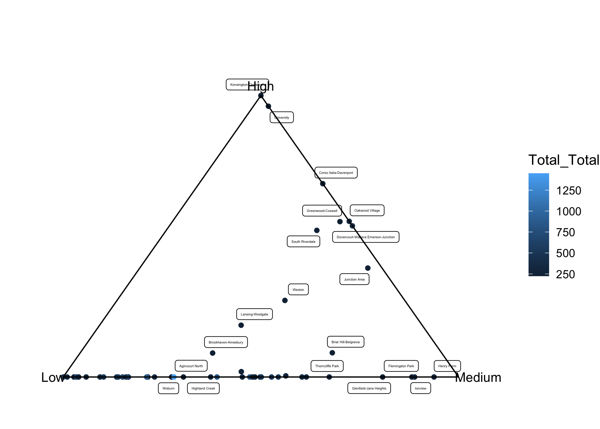
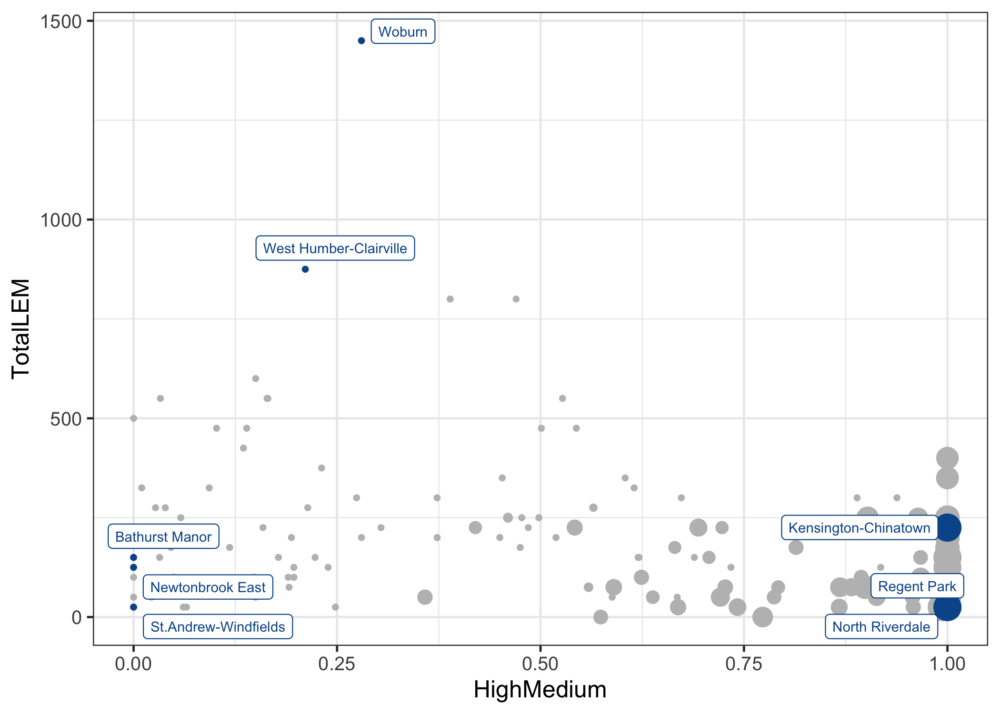

Story 2
================
9/21/2021

# Story 2 Concept

1.  omg look at this app, you can click these layers!

    -   **Concept: the horseshoe is where we start to see the line
        between rich and poor**

        -   proximity?!? everything is downtown, where its expensive

        -   evictions?!? oh no poor neighbourhoods seem more

2.  toronto is sort of “three cities” where the rich live with the rich,
    poor with the poor, and the middle with the middle \[if such a thing
    exists\], but historically, it used to be these mixed income
    neighbourhoods with maybe some exceptions like rosedale or whatever

    -   **Concept: we’re trying to show this with evictions & housing
        needs + LEMR availability**

3.  so then proximity can sort of show the current story of the poor

    -   **Concept: we’re trying to show these two distinct clusters of
        neighbourhoods**

        -   poor means you can either live with low access to service
            *OR* in toronto community housing

## lowend similarities

<!-- -->

<table class="table" style="margin-left: auto; margin-right: auto;">
<caption>
Highlighted Neighbourhoods
</caption>
<thead>
<tr>
<th style="text-align:left;">
Neighbourhood
</th>
<th style="text-align:right;">
Total Total
</th>
<th style="text-align:left;">
Eviction Rate
</th>
<th style="text-align:left;">
Unaffordable Housing
</th>
<th style="text-align:left;">
Market Prop Other Non Market
</th>
<th style="text-align:left;">
Core Housing Need
</th>
</tr>
</thead>
<tbody>
<tr>
<td style="text-align:left;">
Woburn
</td>
<td style="text-align:right;">
1450
</td>
<td style="text-align:left;">
5.3%
</td>
<td style="text-align:left;">
43.6%
</td>
<td style="text-align:left;">
27.1%
</td>
<td style="text-align:left;">
49.0%
</td>
</tr>
<tr>
<td style="text-align:left;">
West Humber-Clairville
</td>
<td style="text-align:right;">
875
</td>
<td style="text-align:left;">
5.6%
</td>
<td style="text-align:left;">
42.1%
</td>
<td style="text-align:left;">
13.0%
</td>
<td style="text-align:left;">
36.7%
</td>
</tr>
<tr>
<td style="text-align:left;">
York University Heights
</td>
<td style="text-align:right;">
550
</td>
<td style="text-align:left;">
11.9%
</td>
<td style="text-align:left;">
48.7%
</td>
<td style="text-align:left;">
7.2%
</td>
<td style="text-align:left;">
43.5%
</td>
</tr>
<tr>
<td style="text-align:left;">
Dovercourt-Wallace Emerson-Junction
</td>
<td style="text-align:right;">
400
</td>
<td style="text-align:left;">
3.4%
</td>
<td style="text-align:left;">
49.2%
</td>
<td style="text-align:left;">
7.1%
</td>
<td style="text-align:left;">
34.7%
</td>
</tr>
<tr>
<td style="text-align:left;">
Thorncliffe Park
</td>
<td style="text-align:right;">
300
</td>
<td style="text-align:left;">
2.4%
</td>
<td style="text-align:left;">
51.9%
</td>
<td style="text-align:left;">
6.3%
</td>
<td style="text-align:left;">
51.0%
</td>
</tr>
</tbody>
</table>

## proximity

<!-- -->
<table class="table" style="margin-left: auto; margin-right: auto;">
<caption>
Filtered @225 total\_total neighbourhoods
</caption>
<thead>
<tr>
<th style="text-align:left;">
Neighbourhood
</th>
<th style="text-align:left;">
High
</th>
<th style="text-align:left;">
Medium
</th>
<th style="text-align:left;">
Low
</th>
<th style="text-align:right;">
Total Total
</th>
<th style="text-align:right;">
Number of Buildings
</th>
</tr>
</thead>
<tbody>
<tr>
<td style="text-align:left;">
Agincourt North
</td>
<td style="text-align:left;">
0.0%
</td>
<td style="text-align:left;">
30.4%
</td>
<td style="text-align:left;">
69.6%
</td>
<td style="text-align:right;">
225
</td>
<td style="text-align:right;">
3
</td>
</tr>
<tr>
<td style="text-align:left;">
Agincourt South-Malvern West
</td>
<td style="text-align:left;">
0.0%
</td>
<td style="text-align:left;">
9.3%
</td>
<td style="text-align:left;">
90.7%
</td>
<td style="text-align:right;">
325
</td>
<td style="text-align:right;">
3
</td>
</tr>
<tr>
<td style="text-align:left;">
Bendale
</td>
<td style="text-align:left;">
0.0%
</td>
<td style="text-align:left;">
52.7%
</td>
<td style="text-align:left;">
47.3%
</td>
<td style="text-align:right;">
550
</td>
<td style="text-align:right;">
14
</td>
</tr>
<tr>
<td style="text-align:left;">
Birchcliffe-Cliffside
</td>
<td style="text-align:left;">
0.0%
</td>
<td style="text-align:left;">
23.1%
</td>
<td style="text-align:left;">
76.9%
</td>
<td style="text-align:right;">
375
</td>
<td style="text-align:right;">
53
</td>
</tr>
<tr>
<td style="text-align:left;">
Briar Hill-Belgravia
</td>
<td style="text-align:left;">
8.6%
</td>
<td style="text-align:left;">
63.7%
</td>
<td style="text-align:left;">
27.6%
</td>
<td style="text-align:right;">
225
</td>
<td style="text-align:right;">
25
</td>
</tr>
<tr>
<td style="text-align:left;">
Brookhaven-Amesbury
</td>
<td style="text-align:left;">
8.5%
</td>
<td style="text-align:left;">
33.5%
</td>
<td style="text-align:left;">
57.9%
</td>
<td style="text-align:right;">
225
</td>
<td style="text-align:right;">
39
</td>
</tr>
<tr>
<td style="text-align:left;">
Clairlea-Birchmount
</td>
<td style="text-align:left;">
0.0%
</td>
<td style="text-align:left;">
38.9%
</td>
<td style="text-align:left;">
61.1%
</td>
<td style="text-align:right;">
800
</td>
<td style="text-align:right;">
31
</td>
</tr>
<tr>
<td style="text-align:left;">
Clanton Park
</td>
<td style="text-align:left;">
0.0%
</td>
<td style="text-align:left;">
5.8%
</td>
<td style="text-align:left;">
94.2%
</td>
<td style="text-align:right;">
250
</td>
<td style="text-align:right;">
59
</td>
</tr>
<tr>
<td style="text-align:left;">
Cliffcrest
</td>
<td style="text-align:left;">
0.0%
</td>
<td style="text-align:left;">
13.5%
</td>
<td style="text-align:left;">
86.5%
</td>
<td style="text-align:right;">
425
</td>
<td style="text-align:right;">
12
</td>
</tr>
<tr>
<td style="text-align:left;">
Corso Italia-Davenport
</td>
<td style="text-align:left;">
68.7%
</td>
<td style="text-align:left;">
31.3%
</td>
<td style="text-align:left;">
0.0%
</td>
<td style="text-align:right;">
250
</td>
<td style="text-align:right;">
5
</td>
</tr>
<tr>
<td style="text-align:left;">
Don Valley Village
</td>
<td style="text-align:left;">
0.0%
</td>
<td style="text-align:left;">
60.4%
</td>
<td style="text-align:left;">
39.6%
</td>
<td style="text-align:right;">
350
</td>
<td style="text-align:right;">
21
</td>
</tr>
<tr>
<td style="text-align:left;">
Dorset Park
</td>
<td style="text-align:left;">
0.0%
</td>
<td style="text-align:left;">
15.0%
</td>
<td style="text-align:left;">
85.0%
</td>
<td style="text-align:right;">
600
</td>
<td style="text-align:right;">
24
</td>
</tr>
<tr>
<td style="text-align:left;">
Dovercourt-Wallace Emerson-Junction
</td>
<td style="text-align:left;">
53.7%
</td>
<td style="text-align:left;">
46.3%
</td>
<td style="text-align:left;">
0.0%
</td>
<td style="text-align:right;">
400
</td>
<td style="text-align:right;">
19
</td>
</tr>
<tr>
<td style="text-align:left;">
Eglinton East
</td>
<td style="text-align:left;">
0.0%
</td>
<td style="text-align:left;">
16.5%
</td>
<td style="text-align:left;">
83.5%
</td>
<td style="text-align:right;">
550
</td>
<td style="text-align:right;">
29
</td>
</tr>
<tr>
<td style="text-align:left;">
Flemingdon Park
</td>
<td style="text-align:left;">
0.0%
</td>
<td style="text-align:left;">
88.2%
</td>
<td style="text-align:left;">
11.8%
</td>
<td style="text-align:right;">
225
</td>
<td style="text-align:right;">
17
</td>
</tr>
<tr>
<td style="text-align:left;">
Glenfield-Jane Heights
</td>
<td style="text-align:left;">
0.0%
</td>
<td style="text-align:left;">
80.8%
</td>
<td style="text-align:left;">
19.2%
</td>
<td style="text-align:right;">
225
</td>
<td style="text-align:right;">
24
</td>
</tr>
<tr>
<td style="text-align:left;">
Greenwood-Coxwell
</td>
<td style="text-align:left;">
55.2%
</td>
<td style="text-align:left;">
42.4%
</td>
<td style="text-align:left;">
2.4%
</td>
<td style="text-align:right;">
225
</td>
<td style="text-align:right;">
15
</td>
</tr>
<tr>
<td style="text-align:left;">
Henry Farm
</td>
<td style="text-align:left;">
0.0%
</td>
<td style="text-align:left;">
93.8%
</td>
<td style="text-align:left;">
6.2%
</td>
<td style="text-align:right;">
300
</td>
<td style="text-align:right;">
16
</td>
</tr>
<tr>
<td style="text-align:left;">
Highland Creek
</td>
<td style="text-align:left;">
0.0%
</td>
<td style="text-align:left;">
37.3%
</td>
<td style="text-align:left;">
62.7%
</td>
<td style="text-align:right;">
300
</td>
<td style="text-align:right;">
0
</td>
</tr>
<tr>
<td style="text-align:left;">
Ionview
</td>
<td style="text-align:left;">
0.0%
</td>
<td style="text-align:left;">
88.9%
</td>
<td style="text-align:left;">
11.1%
</td>
<td style="text-align:right;">
300
</td>
<td style="text-align:right;">
34
</td>
</tr>
<tr>
<td style="text-align:left;">
Junction Area
</td>
<td style="text-align:left;">
38.7%
</td>
<td style="text-align:left;">
57.7%
</td>
<td style="text-align:left;">
3.6%
</td>
<td style="text-align:right;">
250
</td>
<td style="text-align:right;">
6
</td>
</tr>
<tr>
<td style="text-align:left;">
Kennedy Park
</td>
<td style="text-align:left;">
0.0%
</td>
<td style="text-align:left;">
13.9%
</td>
<td style="text-align:left;">
86.1%
</td>
<td style="text-align:right;">
475
</td>
<td style="text-align:right;">
22
</td>
</tr>
<tr>
<td style="text-align:left;">
Kensington-Chinatown
</td>
<td style="text-align:left;">
100.0%
</td>
<td style="text-align:left;">
0.0%
</td>
<td style="text-align:left;">
0.0%
</td>
<td style="text-align:right;">
225
</td>
<td style="text-align:right;">
28
</td>
</tr>
<tr>
<td style="text-align:left;">
L’Amoreaux
</td>
<td style="text-align:left;">
0.4%
</td>
<td style="text-align:left;">
56.1%
</td>
<td style="text-align:left;">
43.5%
</td>
<td style="text-align:right;">
275
</td>
<td style="text-align:right;">
20
</td>
</tr>
<tr>
<td style="text-align:left;">
Lansing-Westgate
</td>
<td style="text-align:left;">
18.4%
</td>
<td style="text-align:left;">
35.8%
</td>
<td style="text-align:left;">
45.8%
</td>
<td style="text-align:right;">
225
</td>
<td style="text-align:right;">
13
</td>
</tr>
<tr>
<td style="text-align:left;">
Malvern
</td>
<td style="text-align:left;">
0.0%
</td>
<td style="text-align:left;">
47.0%
</td>
<td style="text-align:left;">
52.6%
</td>
<td style="text-align:right;">
800
</td>
<td style="text-align:right;">
5
</td>
</tr>
<tr>
<td style="text-align:left;">
Mimico (includes Humber Bay Shores)
</td>
<td style="text-align:left;">
0.0%
</td>
<td style="text-align:left;">
61.5%
</td>
<td style="text-align:left;">
38.5%
</td>
<td style="text-align:right;">
325
</td>
<td style="text-align:right;">
57
</td>
</tr>
<tr>
<td style="text-align:left;">
Morningside
</td>
<td style="text-align:left;">
0.0%
</td>
<td style="text-align:left;">
0.0%
</td>
<td style="text-align:left;">
99.7%
</td>
<td style="text-align:right;">
500
</td>
<td style="text-align:right;">
10
</td>
</tr>
<tr>
<td style="text-align:left;">
Mount Dennis
</td>
<td style="text-align:left;">
0.0%
</td>
<td style="text-align:left;">
47.7%
</td>
<td style="text-align:left;">
51.9%
</td>
<td style="text-align:right;">
250
</td>
<td style="text-align:right;">
19
</td>
</tr>
<tr>
<td style="text-align:left;">
Mount Olive-Silverstone-Jamestown
</td>
<td style="text-align:left;">
0.0%
</td>
<td style="text-align:left;">
54.4%
</td>
<td style="text-align:left;">
45.6%
</td>
<td style="text-align:right;">
475
</td>
<td style="text-align:right;">
19
</td>
</tr>
<tr>
<td style="text-align:left;">
Newtonbrook West
</td>
<td style="text-align:left;">
0.0%
</td>
<td style="text-align:left;">
2.7%
</td>
<td style="text-align:left;">
97.3%
</td>
<td style="text-align:right;">
275
</td>
<td style="text-align:right;">
22
</td>
</tr>
<tr>
<td style="text-align:left;">
O’Connor-Parkview
</td>
<td style="text-align:left;">
0.0%
</td>
<td style="text-align:left;">
27.4%
</td>
<td style="text-align:left;">
72.6%
</td>
<td style="text-align:right;">
300
</td>
<td style="text-align:right;">
60
</td>
</tr>
<tr>
<td style="text-align:left;">
Oakridge
</td>
<td style="text-align:left;">
0.0%
</td>
<td style="text-align:left;">
21.4%
</td>
<td style="text-align:left;">
78.6%
</td>
<td style="text-align:right;">
275
</td>
<td style="text-align:right;">
14
</td>
</tr>
<tr>
<td style="text-align:left;">
Oakwood Village
</td>
<td style="text-align:left;">
55.3%
</td>
<td style="text-align:left;">
44.7%
</td>
<td style="text-align:left;">
0.0%
</td>
<td style="text-align:right;">
350
</td>
<td style="text-align:right;">
33
</td>
</tr>
<tr>
<td style="text-align:left;">
Parkwoods-Donalda
</td>
<td style="text-align:left;">
1.9%
</td>
<td style="text-align:left;">
44.1%
</td>
<td style="text-align:left;">
54.0%
</td>
<td style="text-align:right;">
250
</td>
<td style="text-align:right;">
53
</td>
</tr>
<tr>
<td style="text-align:left;">
Pleasant View
</td>
<td style="text-align:left;">
0.0%
</td>
<td style="text-align:left;">
49.8%
</td>
<td style="text-align:left;">
50.2%
</td>
<td style="text-align:right;">
250
</td>
<td style="text-align:right;">
3
</td>
</tr>
<tr>
<td style="text-align:left;">
Rouge
</td>
<td style="text-align:left;">
0.0%
</td>
<td style="text-align:left;">
3.3%
</td>
<td style="text-align:left;">
96.7%
</td>
<td style="text-align:right;">
550
</td>
<td style="text-align:right;">
19
</td>
</tr>
<tr>
<td style="text-align:left;">
Scarborough Village
</td>
<td style="text-align:left;">
0.0%
</td>
<td style="text-align:left;">
1.0%
</td>
<td style="text-align:left;">
99.0%
</td>
<td style="text-align:right;">
325
</td>
<td style="text-align:right;">
21
</td>
</tr>
<tr>
<td style="text-align:left;">
South Riverdale
</td>
<td style="text-align:left;">
52.1%
</td>
<td style="text-align:left;">
38.1%
</td>
<td style="text-align:left;">
9.8%
</td>
<td style="text-align:right;">
250
</td>
<td style="text-align:right;">
20
</td>
</tr>
<tr>
<td style="text-align:left;">
Stonegate-Queensway
</td>
<td style="text-align:left;">
0.0%
</td>
<td style="text-align:left;">
48.5%
</td>
<td style="text-align:left;">
51.5%
</td>
<td style="text-align:right;">
225
</td>
<td style="text-align:right;">
84
</td>
</tr>
<tr>
<td style="text-align:left;">
Tam O’Shanter-Sullivan
</td>
<td style="text-align:left;">
0.0%
</td>
<td style="text-align:left;">
45.3%
</td>
<td style="text-align:left;">
54.7%
</td>
<td style="text-align:right;">
350
</td>
<td style="text-align:right;">
21
</td>
</tr>
<tr>
<td style="text-align:left;">
Thistletown-Beaumond Heights
</td>
<td style="text-align:left;">
0.0%
</td>
<td style="text-align:left;">
15.9%
</td>
<td style="text-align:left;">
84.1%
</td>
<td style="text-align:right;">
225
</td>
<td style="text-align:right;">
4
</td>
</tr>
<tr>
<td style="text-align:left;">
Thorncliffe Park
</td>
<td style="text-align:left;">
0.0%
</td>
<td style="text-align:left;">
67.3%
</td>
<td style="text-align:left;">
32.7%
</td>
<td style="text-align:right;">
300
</td>
<td style="text-align:right;">
32
</td>
</tr>
<tr>
<td style="text-align:left;">
University
</td>
<td style="text-align:left;">
96.2%
</td>
<td style="text-align:left;">
3.8%
</td>
<td style="text-align:left;">
0.0%
</td>
<td style="text-align:right;">
225
</td>
<td style="text-align:right;">
6
</td>
</tr>
<tr>
<td style="text-align:left;">
West Hill
</td>
<td style="text-align:left;">
0.0%
</td>
<td style="text-align:left;">
10.2%
</td>
<td style="text-align:left;">
89.8%
</td>
<td style="text-align:right;">
475
</td>
<td style="text-align:right;">
18
</td>
</tr>
<tr>
<td style="text-align:left;">
West Humber-Clairville
</td>
<td style="text-align:left;">
0.0%
</td>
<td style="text-align:left;">
21.1%
</td>
<td style="text-align:left;">
78.9%
</td>
<td style="text-align:right;">
875
</td>
<td style="text-align:right;">
11
</td>
</tr>
<tr>
<td style="text-align:left;">
Weston
</td>
<td style="text-align:left;">
27.1%
</td>
<td style="text-align:left;">
42.3%
</td>
<td style="text-align:left;">
30.2%
</td>
<td style="text-align:right;">
225
</td>
<td style="text-align:right;">
47
</td>
</tr>
<tr>
<td style="text-align:left;">
Wexford/Maryvale
</td>
<td style="text-align:left;">
0.0%
</td>
<td style="text-align:left;">
50.1%
</td>
<td style="text-align:left;">
49.9%
</td>
<td style="text-align:right;">
475
</td>
<td style="text-align:right;">
47
</td>
</tr>
<tr>
<td style="text-align:left;">
Woburn
</td>
<td style="text-align:left;">
0.0%
</td>
<td style="text-align:left;">
28.0%
</td>
<td style="text-align:left;">
72.0%
</td>
<td style="text-align:right;">
1450
</td>
<td style="text-align:right;">
44
</td>
</tr>
<tr>
<td style="text-align:left;">
York University Heights
</td>
<td style="text-align:left;">
0.0%
</td>
<td style="text-align:left;">
16.4%
</td>
<td style="text-align:left;">
83.6%
</td>
<td style="text-align:right;">
550
</td>
<td style="text-align:right;">
26
</td>
</tr>
<tr>
<td style="text-align:left;">
Yorkdale-Glen Park
</td>
<td style="text-align:left;">
0.0%
</td>
<td style="text-align:left;">
3.9%
</td>
<td style="text-align:left;">
96.1%
</td>
<td style="text-align:right;">
275
</td>
<td style="text-align:right;">
20
</td>
</tr>
</tbody>
</table>

<!-- -->

<table class="table" style="margin-left: auto; margin-right: auto;">
<caption>
Highlighted Neighbourhoods
</caption>
<thead>
<tr>
<th style="text-align:left;">
Neighbourhood
</th>
<th style="text-align:left;">
High
</th>
<th style="text-align:left;">
Medium
</th>
<th style="text-align:left;">
Low
</th>
<th style="text-align:right;">
Total Total
</th>
<th style="text-align:right;">
Number of Buildings
</th>
</tr>
</thead>
<tbody>
<tr>
<td style="text-align:left;">
Dovercourt-Wallace Emerson-Junction
</td>
<td style="text-align:left;">
53.7%
</td>
<td style="text-align:left;">
46.3%
</td>
<td style="text-align:left;">
0.0%
</td>
<td style="text-align:right;">
400
</td>
<td style="text-align:right;">
19
</td>
</tr>
<tr>
<td style="text-align:left;">
Thorncliffe Park
</td>
<td style="text-align:left;">
0.0%
</td>
<td style="text-align:left;">
67.3%
</td>
<td style="text-align:left;">
32.7%
</td>
<td style="text-align:right;">
300
</td>
<td style="text-align:right;">
32
</td>
</tr>
<tr>
<td style="text-align:left;">
West Humber-Clairville
</td>
<td style="text-align:left;">
0.0%
</td>
<td style="text-align:left;">
21.1%
</td>
<td style="text-align:left;">
78.9%
</td>
<td style="text-align:right;">
875
</td>
<td style="text-align:right;">
11
</td>
</tr>
<tr>
<td style="text-align:left;">
Woburn
</td>
<td style="text-align:left;">
0.0%
</td>
<td style="text-align:left;">
28.0%
</td>
<td style="text-align:left;">
72.0%
</td>
<td style="text-align:right;">
1450
</td>
<td style="text-align:right;">
44
</td>
</tr>
<tr>
<td style="text-align:left;">
York University Heights
</td>
<td style="text-align:left;">
0.0%
</td>
<td style="text-align:left;">
16.4%
</td>
<td style="text-align:left;">
83.6%
</td>
<td style="text-align:right;">
550
</td>
<td style="text-align:right;">
26
</td>
</tr>
</tbody>
</table>

## toronto housing

### in progressssssssss :)

<!-- -->

<!-- -->
